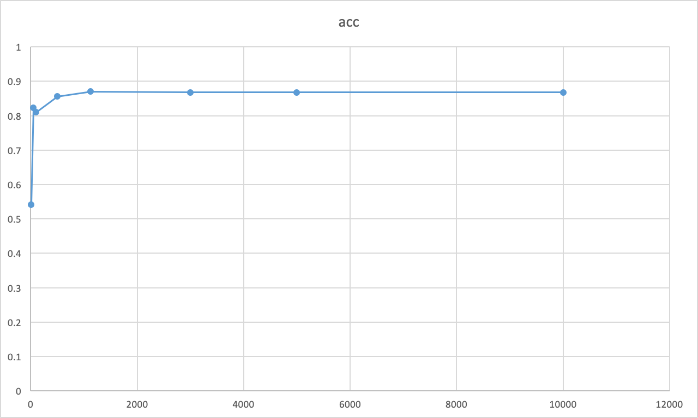

# Discrete-HMM
implement the discrete HMM and related Baum-Welch algorithm and Viterbi algorithm NTU DSP HW1

## How to use
1. compile
```sh
$ make
```
   - or you can just specify `gcc -O3 -o train train.c` and `gcc -O3 -o test test.c`

2. execute
```sh
$ ./train 10 model_init.txt seq_model_05.txt ./results/model_05.txt
$ ./test ./results/modellist.txt testing_data1.txt result1.txt
```

## 執行環境

執行環境為 NTU CSIE 的工作站，詳細的環境如下
```sh
OS: Arch Linux 4.20.7
gcc: gcc version 8.2.1 20181127
```

## 程式架構

- train.cpp:
實作 Baum–Welch algorithm，這部分是照著[維基百科](https://en.wikipedia.org/wiki/Baum%E2%80%93Welch_algorithm)的資料來做，對每一 sequence_model 計算完 alpha 和 beta，並且累加至 gamma 與 epsilon。為了更新 HMM 模型，當 sequence_model 都處理過一次時，以 sum_gamma_init 計算 gamma 初始機率的總和、sum_condition_gamma 計算當在時間 t 的觀測值與 v_k 相同時的 gamma 總和、sum_gamma 計算各個狀態在時間 t 時的 gamma 值 ... 等等，最後再計算出新的轉移機率、觀察機率以及初始機率，並更新 HMM。

- test.cpp:
實作 Viterbi Algorithm，這部分是照著助教的[投影片](http://speech.ee.ntu.edu.tw/DSP2019Spring/hw1/dsp_hw1.pdf)實作

## 分析結果與相關資料
我測試過訓練 10 次、50 次、100次、500次、1126次、3000次、5000次以及10000次的結果
發現 10 次時，testing_data1 的準確率只有 0.540800，但 50 次時卻顯著上升到 0.822800，100 次時為 0.810000、500 次時為 0.856000、1126 次時為 0.870400、3000 次時為 0.867600、5000 次時為 0.867600，最後 10000 次時為 0.868000。
可以看出，訓練次數 50 次後的模型表現趨於穩定，我最後選用訓練 1126 次的模型作為我這次作業的結果


| iterations | 10 | 50 | 100 | 500 | 1126 | 3000| 5000| 10000 |
| -------- | -------- | -------- | -------- | -------- | -------- | -------- |-------- | -------- | -------- |
| acc | 0.5408     | 0.8228     | 0.81     |0.856|0.8704|0.8676|0.8676|0.868|

- 下圖為 testing data 1 之 accuracy 對 training iteration 作圖




- 也可以在我的 github 上找到相關的[測試結果](https://github.com/rapirent/Discrete-HMM/tree/master/c_cpp/results)


## Author
Kuo Teng, Ding

## LICENSE
MIT
